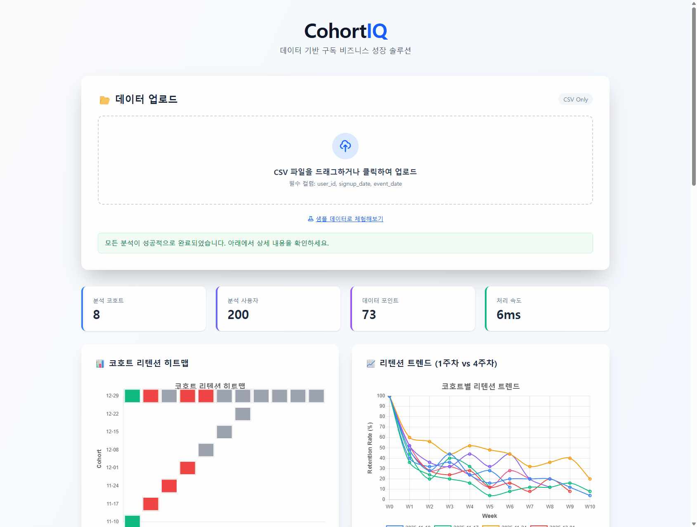
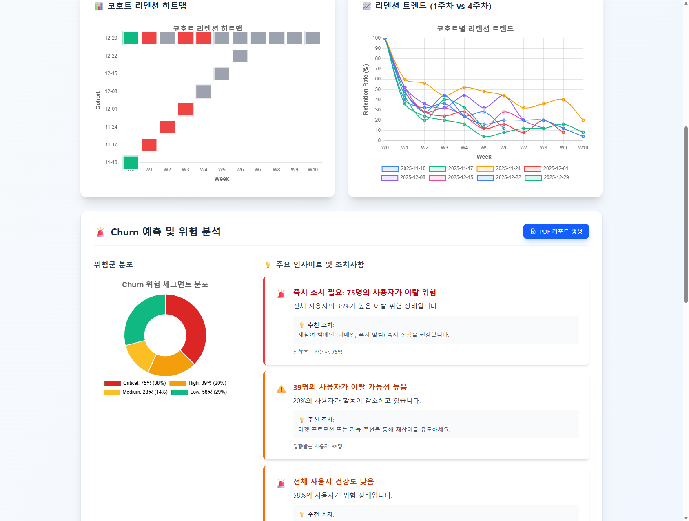
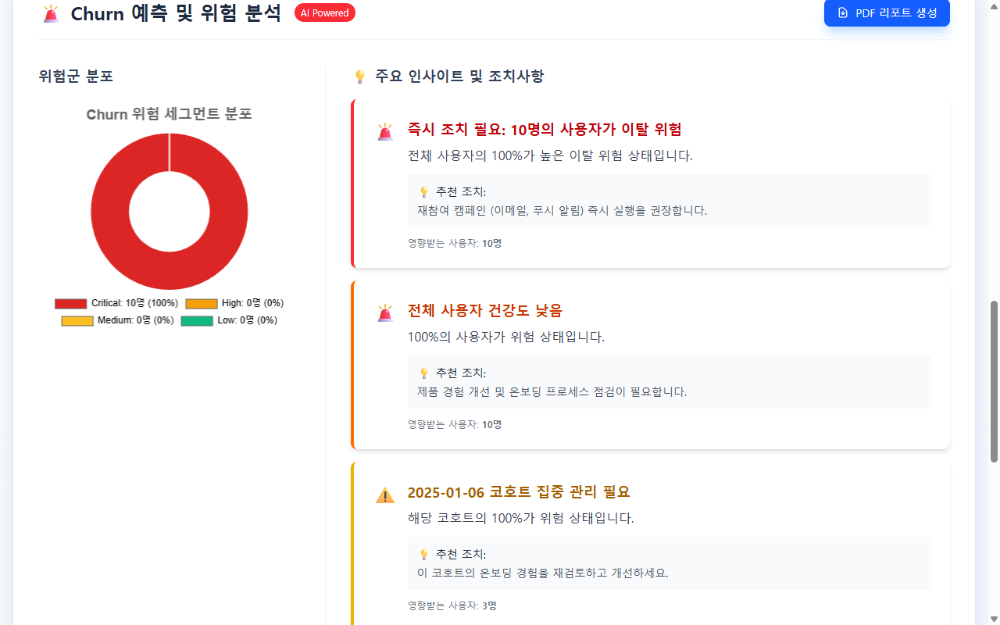
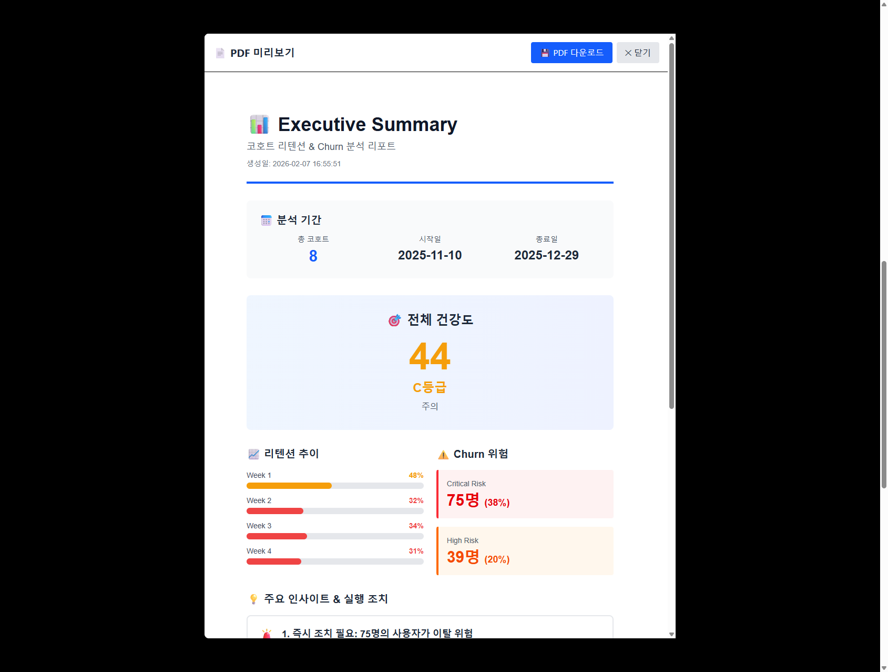

# CohortIQ

**3초 만에 구독 비즈니스의 건강을 진단하는 코호트 분석 도구**

CSV 파일 업로드만으로 코호트 리텐션을 분석하고, 활동 패턴 기반 스코어링으로 이탈 위험 사용자를 식별하며, 통계 검정으로 유의성을 검증하고, LTV를 예측하여 1-Page Executive Summary PDF를 자동 생성합니다.

[](https://cohort-iq.vercel.app)


> **[Live Demo](https://cohort-iq.vercel.app)** - 샘플 데이터(1,010명)로 즉시 체험해보세요

<p align="center">
  
</p>

---

## 소개 영상

Remotion(React) 기반으로 제작한 25초 프로덕트 소개 영상입니다.

| 씬 | 시간 | 내용 |
|----|------|------|
| Intro | 0-4초 | CohortIQ 로고 + 태그라인 |
| 문제점 | 4-9초 | 기존 코호트 분석의 한계 (시간/비용/복잡성) |
| 해결책 | 9-14초 | "세 단계. 단 3초." CSV → 분석 → 인사이트 |
| 주요 기능 | 14-20초 | 히트맵, 이탈 스코어링, LTV, 통계 검정, A/B 테스트, PDF |
| Closing | 20-25초 | 무료 · 빠름 · 오픈소스 + URL |

```bash
# 로컬에서 영상 렌더링
cd cohort-iq-video
npm install
npm run studio   # Remotion Studio에서 미리보기 (localhost:3000)
npm run render   # MP4 렌더링 → out/CohortIQ-Intro.mp4
```

---

## 핵심 질문 & 주요 발견

이 프로젝트는 **"구독 서비스 1,010명의 사용자 데이터에서 무엇을 발견할 수 있는가?"** 에 답합니다.

| 핵심 질문 | 주요 발견 | 통계적 근거 |
|-----------|----------|------------|
| **Q1.** 이탈이 집중되는 시점은? | Week 1→2에서 **35.1%p 하락** — 최대 이탈 구간 | 평균 리텐션 커브 분석 |
| **Q2.** 코호트 간 차이가 유의한가? | 후기 코호트 Week 1 리텐션이 **15%p 낮음** | Chi-Square χ²=84.24, **p<0.001** |
| **Q3.** 생존 패턴과 LTV 예측은? | 중앙 생존 **1.6주**, 초기/후기 차이 유의 | Log-Rank **p=0.007** |

**전략적 시사점**: 사용자 획득에는 성공(Week 1: 69.9%)하지만 가치 전달에 실패(Week 4: 5.7%)하는 서비스. **Week 2 이탈 방지가 가장 큰 ROI를 제공하는 개선 기회.**

→ [상세 분석 보기 (Case Study)](docs/CASE_STUDY.md) | [분석 방법론](docs/METHODOLOGY.md)

---

## 분석 역량

이 프로젝트는 다음 데이터 분석 역량을 시연합니다:

- **코호트 분석**: 가입일 기준 사용자 그룹화 및 주차별 리텐션 추적
- **고객 세그먼테이션**: 활동 패턴 기반 이탈 위험 분류 (Recency, Frequency, Consistency)
- **LTV 예측**: 지수 감쇠 모델(Exponential Decay)을 통한 코호트별 고객 생애 가치 추정
- **통계 검정**: Chi-Square 독립성 검정, Kaplan-Meier 생존 분석, Log-Rank Test — 웹앱 내 실시간 수행
- **비즈니스 메트릭 설계**: 건강도 점수, 리텐션율, Churn Rate, Median Survival 자동 산출
- **데이터 시각화**: 히트맵, 생존곡선, 트렌드/바/도넛 차트로 패턴 시각화
- **인사이트 도출**: 데이터 + 통계 기반 실행 가능한 비즈니스 추천 자동 생성
- **SQL 구현**: PostgreSQL CTE/Window Function으로 분석 로직 재구현
- **다국어 지원**: 한국어/영어 전환 (142개 번역 키)

---

## 주요 기능

### 1. 코호트 리텐션 분석
- 가입일 기준 주간(Weekly) 코호트 자동 생성
- 리텐션 히트맵 + 트렌드 라인 차트 시각화
- **Kaplan-Meier 생존곡선** — 사용자 이탈 패턴의 시간적 분포
- 처리 속도: 10,000행 기준 3초 이내



### 2. Churn 위험 예측 + 통계 검정
- 활동 패턴(Recency, Frequency, Consistency) 기반 위험 스코어링 (0-100)
- CRITICAL / HIGH / MEDIUM / LOW 4단계 세그먼트 분류
- **Chi-Square 검정**: 코호트와 이탈 위험 간 독립성 검정 (p-value)
- **Log-Rank 검정**: 초기 vs 후기 코호트 생존곡선 비교
- 실행 가능한 인사이트 및 추천 조치 자동 생성



### 3. LTV 예측
- 지수 감쇠 모델: λ = -ln(R_last / R_prev) / Δt
- 코호트별 관측 LTV + 예측 LTV 비교 차트
- 신뢰도(High/Medium/Low) 기반 예측 품질 평가
- ARPU 조정을 통한 매출 시나리오 분석

### 4. Executive Summary PDF
- 건강도 점수 (A/B/C/D 등급)
- 리텐션 추이 + Churn 위험 + LTV 요약
- 1-Page PDF 다운로드



### 5. 다국어 지원 (i18n)
- 한국어(KO) / 영어(EN) 실시간 전환
- 142개 번역 키, 분석 결과 및 인사이트 포함

---

## 빠른 시작

### 온라인 (권장)
1. [https://cohort-iq.vercel.app](https://cohort-iq.vercel.app) 접속
2. "샘플 체험" 클릭 (1,010명 사용자 데이터)
3. Retention → Churn Risk → LTV 탭 전환으로 분석 결과 확인
4. PDF 리포트 다운로드

### 로컬 실행
```bash
git clone https://github.com/Taek-D/cohort-iq.git
cd cohort-iq
npm install
npm run dev
```

### 테스트
```bash
npm run test     # 단위 테스트 (80개)
npm run build    # 프로덕션 빌드
```

---

## CSV 데이터 형식

필수 컬럼 3개:

| 컬럼명 | 설명 | 예시 |
|--------|------|------|
| `user_id` | 사용자 고유 식별자 | U001 |
| `signup_date` | 가입일 (YYYY-MM-DD) | 2025-01-06 |
| `event_date` | 활동 발생일 (YYYY-MM-DD) | 2025-01-13 |

```csv
user_id,signup_date,event_date
U001,2025-01-06,2025-01-06
U001,2025-01-06,2025-01-13
U002,2025-01-06,2025-01-06
```

- 파일 크기: 최대 10,000행
- 모든 데이터는 브라우저 내에서만 처리 (서버 전송 없음)

---

## 통계 분석 방법론

| 검정 | 구현 | 목적 |
|------|------|------|
| **Chi-Square** (χ²) | 순수 JS (불완전 감마함수) | 코호트별 이탈 위험 분포 독립성 |
| **Kaplan-Meier** | Product-Limit Estimator | 사용자 생존곡선, 중앙 생존시간 |
| **Log-Rank** | Mantel-Cox 검정 | 초기/후기 코호트 생존곡선 차이 |
| **LTV 예측** | 지수 감쇠 모델 | 코호트별 고객 생애 가치 추정 |

웹앱에서 분석 시 자동으로 통계 검정이 수행되며, p-value와 유의성 판단이 함께 표시됩니다.

Python 노트북(`analysis/cohort_eda.ipynb`)에서는 lifelines, scipy를 사용한 추가 분석도 확인 가능합니다.

---

## 기술 스택

| 분류 | 기술 |
|------|------|
| Core | Vanilla JavaScript (ES6+ Module) |
| Build | Vite 7 |
| Test | Vitest (80 tests) |
| Data | PapaParse, date-fns |
| Visualization | Chart.js + chartjs-chart-matrix |
| Statistics | 순수 JS (Chi-Square, KM, Log-Rank, Gamma functions) |
| Export | jsPDF, html2canvas-pro |
| Styling | Tailwind CSS 4 |
| i18n | Custom module (KO/EN, 142 keys) |
| Performance | Web Worker |
| Hosting | Vercel |
| Analysis | Python, pandas, scipy, lifelines |
| Video | Remotion (React 기반 영상 생성) |
| Database | PostgreSQL (SQL 쿼리 예시) |

---

## 문서

| 문서 | 설명 |
|------|------|
| [분석 방법론](docs/METHODOLOGY.md) | 스코어링 알고리즘, 임계값 근거, 업계 벤치마크, 통계 검정 |
| [분석 사례](docs/CASE_STUDY.md) | 샘플 데이터 기반 비즈니스 분석 시뮬레이션 |
| [EDA 노트북](analysis/cohort_eda.ipynb) | Python/pandas EDA + Chi-Square, Kaplan-Meier, Log-Rank (실행 결과 포함) |
| [SQL 쿼리](analysis/sql_queries.md) | PostgreSQL 코호트 분석 쿼리 6종 |
| [변경 이력](CHANGELOG.md) | 버전별 변경사항 |

---

## 프로젝트 구조

```
cohort-iq/
├── src/
│   ├── core/
│   │   ├── dataValidator.js      # CSV 검증 + 컬럼 자동 매칭
│   │   ├── cohortAnalysis.js     # 코호트 그룹화 + 리텐션 계산
│   │   ├── churnAnalysis.js      # 활동 패턴 기반 위험 스코어링
│   │   ├── ltvPrediction.js      # 지수 감쇠 LTV 예측 모델
│   │   ├── statisticalTests.js   # Chi-Square, Kaplan-Meier, Log-Rank
│   │   ├── analysisWorker.js     # Web Worker (분석 오프로딩)
│   │   └── *.test.js             # 단위 테스트 (80개)
│   ├── visualization/
│   │   ├── heatmapRenderer.js    # 히트맵 + 트렌드 차트
│   │   ├── churnVisualization.js # 위험 도넛 차트 + 테이블
│   │   ├── ltvVisualization.js   # LTV 바/트렌드 차트 + 비교 테이블
│   │   └── statisticsRenderer.js # Kaplan-Meier 생존곡선 + 검정 결과 카드
│   ├── i18n/
│   │   ├── index.js              # i18n 모듈 (setLocale, t, getLocale)
│   │   ├── ko.js                 # 한국어 번역 (142+ 키)
│   │   └── en.js                 # 영어 번역
│   ├── ui/
│   │   ├── appLayout.js          # 앱 레이아웃 HTML 템플릿
│   │   └── helpers.js            # UI 유틸리티 함수
│   ├── export/
│   │   ├── summaryGenerator.js   # Executive Summary HTML
│   │   └── pdfExporter.js        # HTML → PDF 변환
│   ├── main.js                   # 앱 진입점
│   └── style.css                 # Tailwind CSS + 커스텀 디자인 시스템
├── analysis/
│   ├── cohort_eda.ipynb          # Python EDA 노트북 (36셀, 실행 결과 포함)
│   ├── sql_queries.md            # PostgreSQL 쿼리 6종
│   ├── schema.sql                # 테이블 DDL + 샘플 데이터
│   └── requirements.txt          # Python 의존성
├── public/
│   └── sample_cohort_data.csv    # 샘플 데이터 (1,010명, 2,306행, 16코호트)
├── cohort-iq-video/               # Remotion 소개 영상 프로젝트
│   ├── src/
│   │   ├── scenes/                # 5개 씬 컴포넌트 (TSX)
│   │   ├── CohortIQVideo.tsx      # 메인 컴포지션
│   │   └── styles.ts              # 공유 색상/타이밍 상수
│   └── package.json
├── index.html
├── vite.config.js
└── package.json
```

### 모듈 의존 관계
```
dataValidator → cohortAnalysis → heatmapRenderer
              → churnAnalysis  → churnVisualization
              → ltvPrediction  → ltvVisualization
              → statisticalTests → statisticsRenderer
              → summaryGenerator → pdfExporter
              → analysisWorker (Web Worker)
```

---

## 성능

| 메트릭 | 목표 | 실측 |
|--------|------|------|
| 코호트 분석 (1,010명) | 3초 | ~50ms |
| Churn 스코어링 (1,010명) | 3초 | ~15ms |
| 통계 검정 (Chi², KM, Log-Rank) | 3초 | ~10ms |
| LTV 예측 (16코호트) | 3초 | ~5ms |
| Summary 생성 | 3초 | ~10ms |
| PDF 다운로드 | 5초 | ~3초 |

---

## 라이선스

MIT
